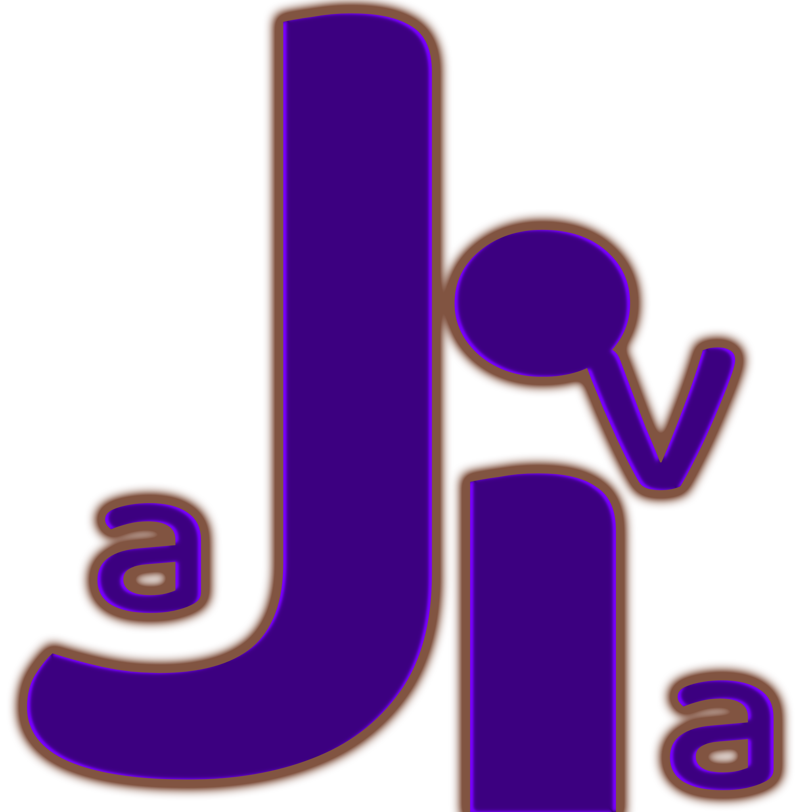
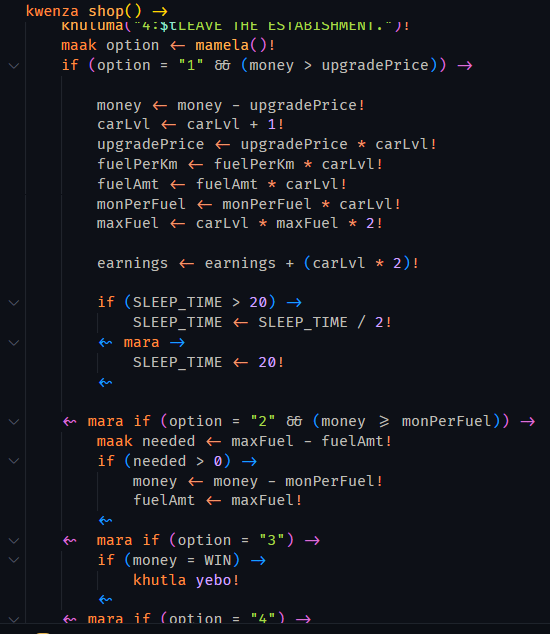

# <center>  Jaiva!

Version **_1.0.0_**

---

This esolang of mine is still in development, so expect alot of updates.

Expect : Confusion, Regret, and a bit of fun.

Expect not : A good time, a good language, or a good experience.

To setup, see [Install.md](./Install.md)
To run, see [CLI.md](./CLI.md)

For a list of global variables and functions, see [Globals.md](./Globals.md)

Jaiva files end in the _`.jiv`_ or _`.jaiva`_ or _`.jva`_ extension.

## <center>Prerquisuiesdsfb

1. **Get and Install (at least) Java 21**
   yeah this isn't a good start 💀 but this shit is amde in java so ye man.
   [Download and install the latest JDK 21](https://jdk.java.net/21)

2. **Set Up Jaiva as a Global Command**  
   Follow the instructions in [Install.md](./Install.md) to configure Jaiva so you can run the `jaiva` command from anywhere on your system.

3. **CLI**
   The basic command to run your file is `jaiva <filePath>` but [CLI.md](./CLI.md) exists.

## <center>Index

-   **[Jaiva!](#jaiva)**
    -   **[Prerequisites](#prerequisites)**
    -   **[Index](#index)** <- you are here.
    -   **[Screenshots](#screenshots)**
    -   **[Syntax](#syntax)**
        -   _[Comments](#comments)_
        -   _[Assignment Operators](#assignment-operators)_
        -   _[Primitives](#primitives)_
            -   [Number](#number)
            -   [Booleans](#booleans)
            -   [Strings](#strings)
                -   [String Operations](#string-operations)
                -   [Escaping Characters](#escaping-characters)
            -   [idk](#idk)
        -   _[Arithmetic and Boolean Comparisons](#arithmetic-and-boolean-comparisons)_
        -   _[Blocks](#blocks)_
    -   **[Keywords](#keywords)**
    -   **[Variables](#variables)**
        -   _[Definition](#definition)_
        -   _[Usage](#usage)_
        -   _[Reassignment](#reassignment)_
    -   **[Arrays](#arrays)**
    -   **[Functions](#functions)**
        -   _[Definition](#definition-1)_
        -   _[Calling](#calling)_
        -   _[Parameters](#parameters)_
            -   [Higher-Order Functions](#higher-order-functions)
            -   [Optional Arguments](#optional-arguments)
    -   **[If Statements](#if-statements)**
        -   _[Basic If](#basic-if)_
        -   _[mara (else)](#mara-else)_
        -   _[mara (else) with if](#mara-else-with-if)_
    -   **[Loops](#loops)**
        -   _[Nikhil Loops (While Loops)](#nikhil-loops-while-loops)_
        -   _[Colonize Loops (For Loops)](#colonize-loops-for-loops)_
            -   [Colonize with (For Each)](#colonize-with-for-each)
        -   _[Control Flow](#control-flow)_
    -   **[Error Handling](#error-handling)**
        -   _[Throw an Error](#throw-an-error)_
        -   _[zama zama (Try) chaai (Catch) Block](#zama-zama-try-chaai-catch-block)_
    -   **[Scopes](#scopes)**
    -   **[Tsea (Import) and Exporting Files](#tsea-import-and-exporting-files)**

## <center>Screenshots



## <center>Syntax

It's simple really, to start off with:

All lines (unless block open and close) must end in an exclamation mark. because why aren't you screaming your code.

```jaiva
maak a <- 10!
```

### Comments.

Single line comments start with an `@`

```jaiva
@ single line comment
```

And multi line comments open and close with the `{` `}`

```jaiva
{
    wus good shawty
    - stfu
}
```

#### Documentation

If you're using something like vscode and would like to document your [variables](#variables) or [functions](#functions), you can use the following syntax

```jaiva
@* My lovely variable.
maak a <- 10!
```

### Assignment operators

`<-` Is the basic assignment operator in this language. Any assignment you do is with this.

> [!NOTE]
> In the case of defining an array, use `<-|`

### Primitives

#### Number

This is just any integer or real number

They don't need any special format, you can just type the number out to use it

```
maak b <- 10!
maak c <- 9.321!
```

(also scientific notation is supported)

```
maak b <- 1e4!
```

#### Bools

`true` and `false` are supported, but so are `aowa` (maps to false) and `yebo` (maps to true). because come on now this is just cool.

They don't need any special format, you can just type the bool out to use it

```
maak b <- aowa!
```

#### Strings

Strings, stolen striaght from Java use `"` (double quotes) to start and end a string.

These are the only characters for strings. No string literals or multi line strings because wtf dawg.

```
maak b <- "String"!
```

To get the length of a string use the `~` operator

```
maak b <- "let's gooo"!
khuluma(b~)! @ returns 10
```

##### String operations.

1. Addition

    `"a" + "string"` _returns_ **`"astring"`**

    `1 + "string"` _returns_ **`"1string"`**

    `"string" + 1` _returns_ **`"string1"`**

2. Subtraction

    `"string" - "tri"` _returns_ **`"sing"`** (removes the first occuramce of rhs from the lhs. Sometimes this dont work tho lol.)

    `"string" - 2` _returns_ **`"stri"`**

    `2 - "string"` _returns_ **`"ring"`**

3. Multiplication

    `"String" * 3` _returns_ **`"StringStringString"`**

4. Division

    `"remove all es please" / "e"` _returns_ **`"rmov all s plas"`** (removes ALL occurences of rhs from the lhs. Sometimes this dont work too lol.)

    `"Hello ong World" / 2` _returns_ **`"Hello o"`** (returns the substring in the range _[0, (lhs' length)/rhs)_ )

    `4 / "Hello ong World"` _returns_ **`"lo ong World"`** (returns the substring in the range _[(rhs' length)/lhs, rhs.length-1)_ )

And of course, you can compare strings to each other using `=` and `!=`

##### Escaping characters

To escape characters in a string use the `$` symbol.

```
maak b <- "String$n"!
```

Table of escape characters

| character              | escape sequence |
| ---------------------- | --------------- |
| `=`                    | `$=`            |
| `,`                    | `$,`            |
| `!`                    | `$!`            |
| `@`                    | `$@`            |
| `\n` (new line)        | `$n`            |
| `\t` (tab)             | `$t`            |
| `\r` (carriage return) | `$r`            |
| `\b` (backspace)       | `$b`            |
| `\f` (form feed)       | `$f`            |
| `"` (double qoutes)    | `$"`            |
| `$`                    | `$$`            |

#### idk

This is a primitive which is used to represent nothingness.

```jaiva
maak a <- idk!
maak b!
maak c <- 10!

khuluma(a = idk)! @ true
khuluma(b = idk)! @ true
khuluma(c != idk)! @ true
```

> [!NOTE]
> In the case of passing `idk` into a function call, unless the paramter is marked as optional, you cannot pass `idk` into a required parameter.

### Arithmatic and Boolean Comparisons

| operation                       | operator |
| ------------------------------- | -------- |
| modulu                          | `%`      |
| division                        | `/`      |
| multiplication                  | `*`      |
| addition                        | `+`      |
| subtraction                     | `-`      |
| unary minus                     | `-`      |
| is equal to (not double equals) | `=`      |
| is not equal to                 | `!=`     |
| greater than (and equal to)     | `>` `>=` |
| less than (and equal to)        | `<` `<=` |
| braces for ordering             | `(` `)`  |

> [!NOTE]
> You cannot negate an expression. Sorry not sorry.

### Blocks

Blocks are defined by the `->` and `<~` symbols. The `->` symbol opens a block, and the `<~` symbol closes it.

I think this is where jaiva deviates from normal programming languages, Especially since your usual `{` `}` is reserved for comments.

> [!NOTE]
> You can have multiple blocks in a single line, but this is not recommended. It makes the code hard to read. (And i dont think i implemented or tested that case.)

> [!NOTE]
> You can only have a block after like, an if, or a function and whatever, you cant just open an new arbitrary block in the middle of your code. This is a design choice, and i think it makes sense.

```jiv
if (a = 10) ->
   @ inner code
<~
```

## <center>Keywords

Alot of the keywords refer to words from south african languages, so if you happen to know one, you've got the advantage
here's a cheat table though

| keyword   | meaning and what it's assigned to                        | language origin |
| --------- | -------------------------------------------------------- | --------------- |
| maak      | make/new (variable declaration keyword)                  | Afrikaans       |
| aowa      | no (`false`)                                             | Sepedi          |
| yebo      | yes (`true`)                                             | Zulu            |
| khuluma   | talk (print to console)                                  | Zulu            |
| mara      | but (`else` block)                                       | Sesotho         |
| kwenza    | does (defines a function)                                | Zulu            |
| khutla    | return (function return keyword)                         | Zulu            |
| colonize  | for (for loop)                                           | English         |
| zama zama | try (try block)                                          | Zulu            |
| cima      | turn off (throw)                                         | Zulu            |
| chaai     | "oh no!" or "oh shit!" (catch block)                     | idk             |
| voetsek   | "fuck off" (`break` keyword)                             | Afrikaans       |
| nevermind | Self-Explanatory (`continue` keyword)                    | English         |
| with      | keyword used to define for each loop along with colonize | English         |
| tsea      | import from another file                                 | Sepedi          |

## <center>Variables

Variables are [scoped](#scopes) constructs.

See [Globals](./Globals.md) for a list of global variables that are available to you.

### Definition

```jiv
maak (variable name) <- (value)!
```

Simple asf

```jiv
maak a <- 20!           @ number
maak var1 <- "string"!  @ string
maak var5 <- aowa!      @ boolean
maak f!                 @ define without a value.
```

Also a neat feature, since only a specifc set of chars are reserved, this allows for some weird variable names that is allowed.

| Statement                                 | Variable Name |
| ----------------------------------------- | ------------- |
| `maak a b <- 10!`                         | `a b`         |
| `maak a  b <- 100!` (diferent from above) | `a  b`        |
| `maak #b... <- 20!`                       | `#b...`       |
| `maak \ <- 10!`                           | `\`           |

And more crazy combos you can come up with. if it doesnt result in a generic Java error, it's probably valid. Go wild.

### Use

```jiv
maak a <- 20!
maak b <- 10!
maak c <- a + b! @ 30
```

### Reassignment

```jiv
maak a <- 20!

a <- 10!
a <- "string"!
```

You can reassign any type really. This shit aint type safe.

## <center> Arrays

**Arrays are 0-indexed. This isn't Lua afterall**

```jiv
maak a <-| 20, 23, 56, 324, 354!
maak b <-|! @ Empty array.
```

Yknow. Then you can access elements of the array using the `[]` operator.

```jiv
maak a <-| 20, 23, 56, 324, 354!
maak b <- a[0]! @ 20
```

To get the length of an array use the `~` operator.

```jiv
maak a <-| 10, 23, 984!
khuluma(a~)! @ returns 3
```

## <center>Functions

Functions are [scoped](#scopes) constructs.

See [Globals](./Globals.md) for a list of global functions that are available to you.

### Defintion

Functions are defined using the `kwenza` keyword, and return values using the `khutla` keyword.

```jiv
kwenza addition(param1, param2) ->
    khutla (param1 + param2)!
<~
```

### Calling

Just like any other language, you can call a function by just using the name of the function and passing in the parameters.

```jiv
maak a <- 10!
maak b <- 20!
maak c <- addition(a, b)! @ 30
@ or
maak c <- addition(10, 20)! @ 30
```

Function parameters can take any type of variable, including arrays and other functions.

### Parameters

#### Higher-Order Functions

In the case wehere you want to pass a function into another function, you will have to input `F~` to the name of the parameter to explicity tell the interpreter that the shi u finna input should be treated as a function.

`V~` is available for variables, but its not needed as without this typing, its always assumed to be a variable

```jiv
kwenza function(F~ref) ->
    khutla ref()!
<~

kwenza returnNum() ->
    khutla 100!
<~

khuluma(function(returnNum))! @ prints 10
```

be careful when you start doing this though as when you start calling and chaining these, you loose variables in scopes since it doesnt know an shi.

#### Optional Arguments

In the case where you need certain arguments to be optional, stolen straight from typescript, all you gotta do is suffix the parameter name with `?` then it will not be required when calling the function.

```jiv
kwenza function(param?) ->
    khuluma(param = idk)! @ When a parameter is optional and it is not given,
                           @ It will be set to the type idk
<~

function()! @ prints true
function(10)! @ prints false
```

> [!WARNING]
> When a parameter is required, it CANNOT be set to [idk](#idk) or be empty in the parameters list of the function call. That's the whole point of a required parameter, that it is a value.

## <center>If Statements

For if statements, `if` is the keyword, and `mara` is the else statement.

### Basic If

```jiv
if (condition) ->
    @ block to execute.
<~
```

```jiv
maak variable <- 10!
if (variable != 100) ->
    khuluma("Variable isn't 100")!
<~
```

### mara (else)

```jiv
if (condition) ->
    @ block to execute
<~ mara ->
    @ block to execute if the condition is false
<~
```

```jiv
if (variable != 100) ->
    khuluma("Variable is not 100")!
<~ mara ->
    khuluma("It's 10")!
<~
```

> [!WARNING]
> You cannot put the mara keyword underneath the end of an if block, it HAS to be on the same line as the closing `<~` symbol. This makes it easier for me lol.

### mara (else) with if

```jiv
if (condition) ->
    @ block to execute
<~ mara if (condition) ->
    @ another block.
<~
```

```jiv
maak variable <- 10!
if (variable != 100) ->
    khuluma("Variable is not 100")!
<~ mara if (variable = 10) ->
    khuluma("Variable is 10")!
<~
```

You can chain as many mara if statements as you want, but this is not recommended. (It makes the code hard to read, and this language is already hard enough to read)

You can also nest if statements. because why not.

> [!WARNING]
> You can use a normal `mara` block along with other `mara if` blocks. However the `mara` block must be the LAST block of the entire if chain.

## <center>Loops

### Nikhil loops (while loops)

Shoutout to Nikhil for this one.

[Twitter](https://x.com/NikhilLala11)
[Instagram](https://www.instagram.com/_nikhil1707_/) <br>
YouTube @nikhil17 (probably idk) <br>
Discord @Nikx17 <br>

```jiv
nikhil (condition) ->
    @ block to execute
<~
```

Where

> `condition` is the condition to check for the loop to continue. This is a boolean expression.

### Colonize loops (for loops)

This ones a bit weird.

```jiv
colonize (variable init) | (condition) | (increment) ->
    @ block to execute
<~
```

Where

> `variable init` is the variable to use in the for loop, and the initial value.

> `condition` is the condition to check for the loop to continue. This is a boolean expression.

> `increment` is the increment to use for the loop. This can be a `+` or a `-` sign.

> and the `|` is the separator between the three parts of the for loop.

```jiv
colonize i <- 0 | i <= 10 | + ->
    khuluma(i)! @ 0, 1, 2, 3, 4, 5, 6, 7, 8, 9, 10
<~
```

#### colonize with (for each)

```jiv
colonize (variable name) with (array) ->
    @ block
<~
```

Where

> `variable name` is the variable to use in the for loop, and the initial value.

> `array` is the array to loop through.

```jiv
colonize word with reservedKeywords ->
    khuluma(word)! @ prints all the reserved keywords
<~
```

### Control flow

For all loops, to forcefully exit a loop, use the `voetsek` keyword.

```jiv
nikhil (a = 10) ->
    khuluma(a)! @ 10
    voetsek! @ this will break out of the loop, stopping it.
<~
```

To skip to the next iteration of a loop, use the `nevermind` keyword.

```jiv
colonize i <- 0 | i <= 10 | + ->
    if (i = 5) ->
        nevermind! @ this will skip the rest of the loop and go to the next iteration.
    <~
    khuluma(i)! @ 0, 1, 2, 3, 4, 6, 7, 8, 9, 10
<~
```

## <center>Error handling

Jaiva has error handling and throwing! This is done using 2 constructs.

### Throw an error

Use the `cima` keyword follwed by the `<==` operator, then followed by the error message.

`<==` is the assignment operator for errors. Literally not used anywhere else but for this.

```jiv
cima <== (error message)!
```

```jiv
maak a <- 10!
if (a = 10) ->
    khuluma("a is 10")!
<~ mara ->
    cima <== "a is not 10"! @ this will throw an error.
<~
```

### zama zama (try) chaai (catch) block

The `zama zama` keyword (both, one `zama` won't work.) is used to define a try block, and the `chaai` keyword is used to define a catch block.

The `chaai` block is executed if an error is thrown in the `zama zama` block.

> [!NOTE]
> When in a chaai block, you have access to a special variable called

> [!WARNING]
> You cannot have a `zama zama` block without a `chaai` block. This is a design choice, and it makes sense.

> [!WARNING]
> You cannot put the `chaai` keyword underneath the end of a `zama zama` block, it HAS to be on the same line as the closing `<~` symbol. This makes it easier for me lol.

```jiv
zama zama ->
    @ block of code to try
<~ chaai ->
    @ block of code to execute if an error is thrown
<~
```

```jiv
zama zama ->
    khuluma(true + 1)!
<~ chaai ->
    khuluma(error)! @ error is a special variable which holds the error message.
<~
```

## <center>Scopes

Everytime you open a block, you create a new scope. This means that any variables or functions you define in that block are not accessible outside of that block.

```jiv
maak a <- 10!
maak b <- 20!
maak c <- 30!

if (a = 10) ->
    maak d <- 40!
    khuluma(d)! @ 40
    kwenza addition(param1, param2) ->
        khuluma(param1 + param2)!
    <~
<~ mara ->
    khuluma(d)! @ This will error, because d isn't defined in this scope.
    khuluma(a)! @ 10. This works because a is defined in the global scope.
<~

addition(10, 20)! @ Will also error, because addition() is not defined in this scope.
```

## <center> Tsea (import) and exporting files

Importing isn't that bad. Here's a simple import.

Say you have "`file.jiv`" with the following code.

```jiv
maak *a <- 10! @ Pre-pend * to the variable name to mark it as a exported variable.
kwenza *addition(param1, param2) -> @ Pre-pend * to the function name to mark it as a exported function.
    khuluma(param1 + param2)!
<~

@ Note: Using the variables/functions are still normal. When using them you don't have to prepend the * to them. It's just simply a marker for the tokenizer to know that this variable/function is exported.
```

Then in your main file, you can import it like this.

```jiv
tsea "file.jiv"! @ or you can have an absolute import.
khuluma(addition(a, 1))! @ 11
```

Or if you want to import a specific variable or function, you can do this.

```jiv
tsea "file.jiv" <- addition!
```

> [!NOTE]
> File paths are relative to the current working directory. So if you have a file in a different directory, you will have to use the full path to the file.

> [!NOTE]
> You can also import files from the Jaiva library. Example to import the arrays files
>
> ```jiv
> tsea "jaiva/arrays"!
> ```
>
> See [Globals](./Globals.md) for a list of global variables and functions that are available to you, and others that you can import.

> [!NOTE]
> Omitting the file extension is okay, however it will default to `.jiv`
