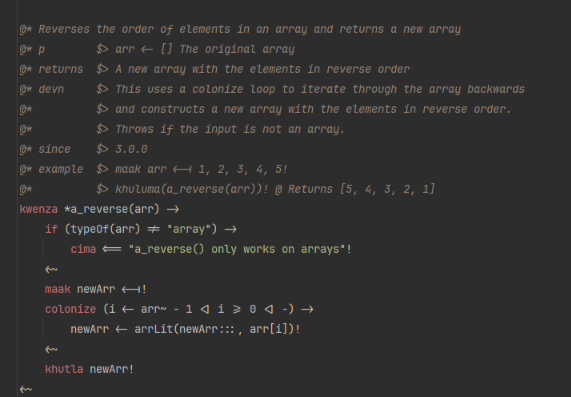
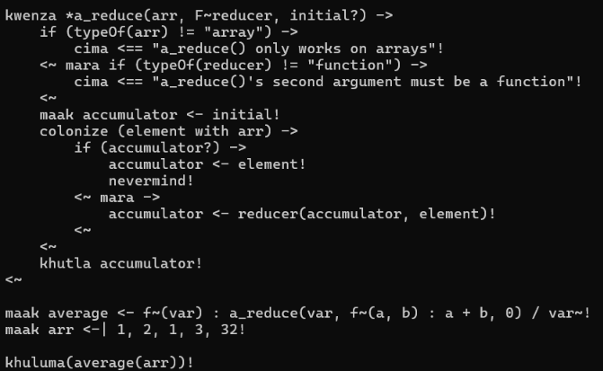
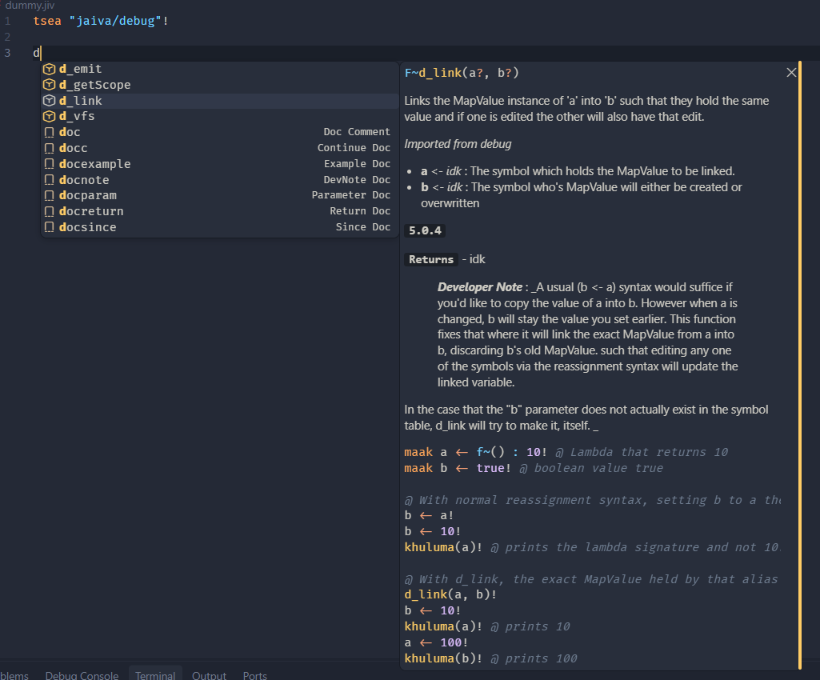

<h1>  Jaiva!</h1>

Version : **_6.0.0-beta.8_**

(Current Stable) Version : **_5.0.4_**

---

A (semi-)functional esoteric programming language made with Java on a random January in 2025. What is the goal? idk.

This is for the most part _supposed_ to be a functional programming language.

Jaiva files end in the _`.jiv`_ or _`.jaiva`_ or _`.jva`_ extension.

# Prerquisuiesdsfb

1. **Get and Install (at least) Java 21**
   yeah this isn't a good start 💀 but this shit is made in java so ye man.
   [Download and install the latest JDK 21](https://jdk.java.net/21)

2. **Set Up Jaiva as a Global Command**  
   Follow the instructions in [Install.md](docs/Install.md) to configure Jaiva so you can run the `jaiva` command from anywhere on your system.

3. **CLI**
   The basic command to run your file is `jaiva <filePath>` but [CLI.md](docs/CLI.md) exists for more info.

# Links

- To setup, see [Install.md](docs/Install.md)
- To run, see [CLI.md](docs/CLI.md)
- To learn, see [Language.md](docs/Language.md)
- To build Jaiva project, see [Build.md](docs/Build.md)
- To embed Jaiva in a Host java app, see [Hosting.md](docs/Hosting.md)
- For a list of variables and functions you have available, see [Libraries.md](docs/Libraries.md)

---

- Jaiva Highlight.js Repo [highlightjs-jaiva](https://github.com/yetnt/highlightjs-jaiva)
- Jaiva Highlight.js NPM [highlightjs-jaiva](https://www.npmjs.com/package/highlightjs-jaiva)
- Jaiva VSCode Extension [vscode](https://github.com/yetnt/jaiva-vscode)