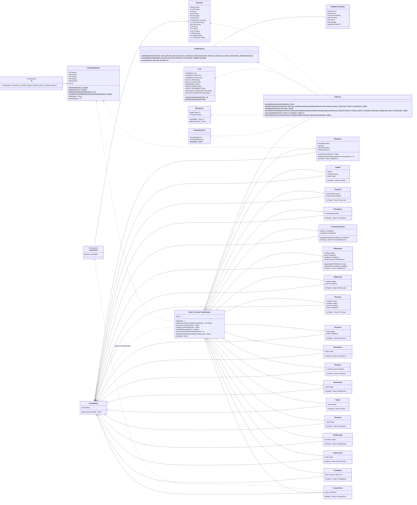

# Tokenizer

If this is too much, go to the folder where i seprated this graph into the tokens and other graph.

```mermaid
classDiagram
direction RL
    class TokenDefault {
	    +name String
	    +getContents(int depth) String
    }

    class Token~T extends TokenDefault~ {
	    -value T
	    +getValue() T
	    +splitByTopLevelComma(String argsString) List~String~
	    +processContext(String line) Object
	    +dispatchContext(String line) Object
	    +isValidBoolInput(Object t) boolean
        -findLastOutermostBracePair(String line) int
        -simplifyIdentifier(String identifier, String prefix) String
	    +toString() String
    }


    class TLoopControl {
        +type LoopControl
        toToken() Token~TLoopControl~
    }

    class TCodeblock {
	    +lines ArrayList~Token~T~~
	    +toToken() Token~TCodeBlock~
    }

    class TUnknownVar {
	    +value Object
	    toToken() Token~TUnknownVar~
    }

    class TVarReassign {
	    +newValue Object
	    +toToken() Token~TVarReassign~
    }

    class TStringVar {
	    +value String
	    +toToken() Token~TStringVar~
    }

    class TIntVar {
	    +value Object
	    +toToken() Token~TIntVar~
    }

    class TBooleanVar {
	    +value Object
	    +toToken() Token~TBooleanVar~
    }

    class TArrayVar {
	    +contents ArrayList~Object~
	    +toToken() Token~TArrayVar~
    }

    class TFuncReturn {
	    +Object value
	    +toToken() Token~TFuncReturn~
    }

    class TFunction {
	    +args String[]
	    +body TCodeblock
	    +toToken() Token~TFunction~
    }

    class TForLoop {
	    +variable TIntVar
	    +condition Object
	    +increment String
	    +body TCodeblock
	    +toToken() Token~TForLoop~
    }

    class TWhileLoop {
	    +condition Object
	    +body TCodeblock
	    +toToken() Token~TWhileLoop~
    }

    class TIfStatement {
	    +condition Object
	    +body TCodeblock
	    +elseBody TCodeblock
	    +elseIfs ArrayList~TIfStatement~
	    +appendElseIf(TIfStatement body)
	    +appendElse(TCodeblock elseBody)
	    +toToken() Token~TIfStatement~
    }

    class TTryCatchStatement {
	    +tryBlock TCodeblock
	    +catchBlock TCodeblock
	    +appendCatchBlock(TCodeblock catchBlock)
	    +toToken() Token~TTryCatchStatement~
    }

    class TThrowError {
	    +errorMessage String
	    +toToken() Token~TThrowError~
    }

    class TFuncCall {
	    +functionName String
	    +args ArrayList~Object~
	    +toToken() Token~TFuncCall~
    }

    class TVarRef {
	    +type int
	    +varName String
	    +index Object
	    +toToken() Token~TVarRef~
    }

    class TStatement {
	    +lHandSide Object
	    +op String
	    +rHandSide Object
	    +statementType int
	    +parse(String statement) Object
	    -findOperatorIndex(String statement, String operator) int
	    +toToken() Token~TStatement~
    }

    Token ..> TokenDefault : generic (T) extends from
    TLoopControl --|> TokenDefault
    TLoopControl o--o Token
    TCodeblock --|> TokenDefault
    TCodeblock o--o Token
    TUnknownVar --|> TokenDefault
    TUnknownVar o--o Token
    TVarReassign --|> TokenDefault
    TVarReassign o--o Token
    TStringVar --|> TokenDefault
    TStringVar o--o Token
    TIntVar --|> TokenDefault
    TIntVar o--o Token
    TBooleanVar --|> TokenDefault
    TBooleanVar o--o Token
    TArrayVar --|> TokenDefault
    TArrayVar o--o Token
    TFuncReturn --|> TokenDefault
    TFuncReturn o--o Token
    TFunction --|> TokenDefault
    TFunction o--o Token
    TForLoop --|> TokenDefault
    TForLoop o--o Token
    TWhileLoop --|> TokenDefault
    TWhileLoop o--o Token
    TIfStatement --|> TokenDefault
    TIfStatement o--o Token
    TTryCatchStatement --|> TokenDefault
    TTryCatchStatement o--o Token
    TThrowError --|> TokenDefault
    TThrowError o--o Token
    TFuncCall --|> TokenDefault
    TFuncCall o--o Token
    TVarRef --|> TokenDefault
    TVarRef o--o Token
    TStatement --|> TokenDefault
    TStatement o--o Token

class EscapeSequence {
    +escape(String str)
    +unescape(String str)
    +escapeAll() String$
}

class Tokenizer {
    -decimateSingleComments(String line) String$
    -handleBlocks(boolean isComment, String line, MultipleLinesOutput multipleLinesOutput, String entireLine, String t, String[] args, Token~?~ blockChain) Object$
    -handleArgs(String type, String line) String[]$
    -processBlockLines(boolean isComment, String line,MultipleLinesOutput multipleLinesOutput,String tokenizerLine, ArrayList~Token~?~~ tokens, Token~?~ tContainer, String type, String[] args, Token~?~ blockChain) Object$
    -processVariable(String line, Token~?~ tContainer) Token~?~$
    +readLine(String line, Stirng previousLine, Object multipleLinesOutput, BlockChain blockChain) Object$

}

class BlockChain {
    -initialIf Token~?~
    -currentLine String
    +getInitialif() Token~?~
    +getCurrentLine() String
}

class ContextDispatcher {
    +SE boolean
    +EB boolean
    +EO boolean
    +BC boolean
    +EIB boolean
    +bits int
    -isBalanced(String s) boolean$
    -isOperator(char c) boolean$
    -findOutermostOperatorIndex(String s) int$
    -checkBracesClosedBeforeOutermostOperand(String line) boolean$
    +toBitString() String
    +getDeligation() To

}

class To {
    <<Enumeration>>
    TSTATEMENT, PROCESS_CONTENT, SINGLE_BRACE, EMPTY_STRING, ERROR
}

class MultipleLinesOutput {
    +startCount int
    +endCount int
    +isComment boolean
    +preLine String
    +type Stirng
    +args String[]
    +specialArg Token~?~
}

class FindEnclosing {
    +charIMultipleLines(String line, String start,String end,int startCount, int endCount, String previousLines, String type, String[] args, Token~?~ blockChain) MultipleLinesOutput$
    +charIMultipleLines(String line, char start, char end,int startCount, int endCount) MultipleLinesOutput$
    +charI(String line, char start, char end) int$
}

class Lang {
    +COMEMNT char
    +COMMENT_OPEN char
    +COMMENT_CLOSE char
    +BLOCK_OPEN String
    +BLOCK_CLOSE String
    +ASSIGNMENT String
    +THROW_ERROR String
    +ARRAY_ASSIGNMENT String
    +ARITHMATIC_OPERATORS Set~String~
    +BOOLEAN_OPERATORS Set~String~
    +containsOperator(char[] string) int $
    +getOperatorIndex(char[] string)$
}
class Keywords {
    +WHILE String
    +D_VAR String
    +IF String
    +ELSE String
    +FALSE String
    +TRUE String
    +CONSOLE_LOG String
    +D_FUNCTION String
    +RETURN String
    +FOR String
    +TRY String
    +CATCH String
    +THROW String
    +LC_BREAK String
    +LC_CONTINUE String
}

class LoopControl {
    <<Enumeration>>
    BREAK, CONTINUE
}

Keywords <-- LoopControl

ContextDispatcher <-- To

MultipleLinesOutput o-- FindEnclosing
Tokenizer --o Token
Tokenizer ..> EscapeSequence
Tokenizer ..> BlockChain
Token ..> ContextDispatcher
TStatement ..> ContextDispatcher
TLoopControl ..> LoopControl
Tokenizer ..> FindEnclosing
Tokenizer ..> Lang
Tokenizer ..> Keywords

```
