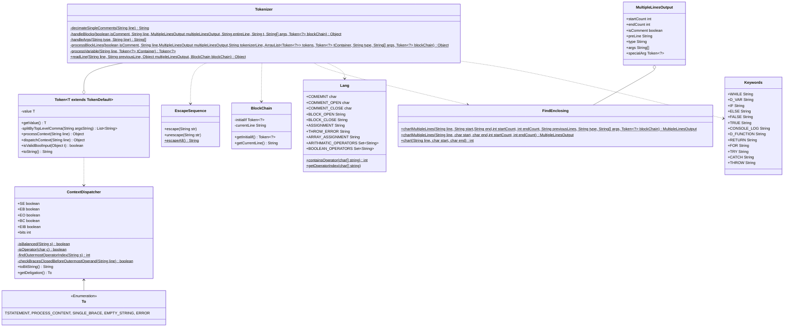

# other classes

```mermaid
classDiagram

class EscapeSequence {
    +escape(String str)
    +unescape(String str)
    +escapeAll() String$
}

class Tokenizer {
    -decimateSingleComments(String line) String$
    -handleBlocks(boolean isComment, String line, MultipleLinesOutput multipleLinesOutput, String entireLine, String t, String[] args, Token~?~ blockChain) Object$
    -handleArgs(String type, String line) String[]$
    -processBlockLines(boolean isComment, String line,MultipleLinesOutput multipleLinesOutput,String tokenizerLine, ArrayList~Token~?~~ tokens, Token~?~ tContainer, String type, String[] args, Token~?~ blockChain) Object$
    -processVariable(String line, Token~?~ tContainer) Token~?~$
    +readLine(String line, Stirng previousLine, Object multipleLinesOutput, BlockChain blockChain) Object$

}

class Token~T extends TokenDefault~ {
    -value T
    +getValue() T
    -splitByTopLevelComma(String argsString) List~String~
    +processContext(String line) Object
    +dispatchContext(String line) Object
    +isValidBoolInput(Object t) boolean
    +toString() String
}

class BlockChain {
    -initialIf Token~?~
    -currentLine String
    +getInitialif() Token~?~
    +getCurrentLine() String
}

class ContextDispatcher {
    +SE boolean
    +EB boolean
    +EO boolean
    +BC boolean
    +EIB boolean
    +bits int
    -isBalanced(String s) boolean$
    -isOperator(char c) boolean$
    -findOutermostOperatorIndex(String s) int$
    -checkBracesClosedBeforeOutermostOperand(String line) boolean$
    +toBitString() String
    +getDeligation() To

}

class To {
    <<Enumeration>>
    TSTATEMENT, PROCESS_CONTENT, SINGLE_BRACE, EMPTY_STRING, ERROR
}

class MultipleLinesOutput {
    +startCount int
    +endCount int
    +isComment boolean
    +preLine String
    +type Stirng
    +args String[]
    +specialArg Token~?~
}

class FindEnclosing {
    +charIMultipleLines(String line, String start,String end,int startCount, int endCount, String previousLines, String type, String[] args, Token~?~ blockChain) MultipleLinesOutput$
    +charIMultipleLines(String line, char start, char end,int startCount, int endCount) MultipleLinesOutput$
    +charI(String line, char start, char end) int$
}

class Lang {
    +COMEMNT char
    +COMMENT_OPEN char
    +COMMENT_CLOSE char
    +BLOCK_OPEN String
    +BLOCK_CLOSE String
    +ASSIGNMENT String
    +THROW_ERROR String
    +ARRAY_ASSIGNMENT String
    +ARITHMATIC_OPERATORS Set~String~
    +BOOLEAN_OPERATORS Set~String~
    +containsOperator(char[] string) int $
    +getOperatorIndex(char[] string)$
}
class Keywords {
    +WHILE String
    +D_VAR String
    +IF String
    +ELSE String
    +FALSE String
    +TRUE String
    +CONSOLE_LOG String
    +D_FUNCTION String
    +RETURN String
    +FOR String
    +TRY String
    +CATCH String
    +THROW String
}

ContextDispatcher <-- To

MultipleLinesOutput o-- FindEnclosing
Tokenizer --o Token
Tokenizer ..> EscapeSequence
Tokenizer ..> BlockChain
Token ..> ContextDispatcher
Tokenizer ..> FindEnclosing
Tokenizer ..> Lang
Tokenizer ..> Keywords

```
