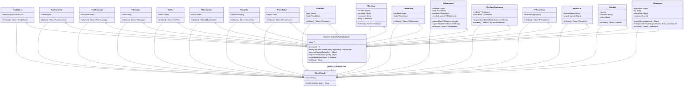

# Tokens class diagram

```mermaid
classDiagram

class TokenDefault {
    +name String
    +getContents(int depth) String
}

class Token~T extends TokenDefault~ {
    -value T
    +getValue() T
    -splitByTopLevelComma(String argsString) List~String~
    +processContext(String line) Object
    +dispatchContext(String line) Object
    +isValidBoolInput(Object t) boolean
    +toString() String
}

Token ..> TokenDefault : generic (T) extends from
class TCodeblock {
    +lines ArrayList~Token~T~~
    +toToken() Token~TCodeBlock~
}
TCodeblock --|> TokenDefault
TCodeblock o--o Token

class TUnknownVar {
    +value Object
    toToken() Token~TUnknownVar~
}
TUnknownVar --|> TokenDefault
TUnknownVar o--o Token

class TVarReassign {
    +newValue Object
    +toToken() Token~TVarReassign~
}
TVarReassign --|> TokenDefault
TVarReassign o--o Token

class TStringVar {
    +value String
    +toToken() Token~TStringVar~
}
TStringVar --|> TokenDefault
TStringVar o--o Token

class TIntVar {
    +value Object
    +toToken() Token~TIntVar~
}
TIntVar --|> TokenDefault
TIntVar o--o Token

class TBooleanVar {
    +value Object
    +toToken() Token~TBooleanVar~
}
TBooleanVar --|> TokenDefault
TBooleanVar o--o Token

class TArrayVar {
    +contents Object[]
    +toToken() Token~TArrayVar~
}
TArrayVar --|> TokenDefault
TArrayVar o--o Token

class TFuncReturn {
    +Object value
    +toToken() Token~TFuncReturn~
}
TFuncReturn --|> TokenDefault
TFuncReturn o--o Token

class TFunction {
    +args String[]
    +body TCodeblock
    +toToken() Token~TFunction~
}
TFunction --|> TokenDefault
TFunction o--o Token

class TForLoop {
    +variable TIntVar
    +condition Object
    +increment String
    +body TCodeblock
    +toToken() Token~TForLoop~
}
TForLoop --|> TokenDefault
TForLoop o--o Token

class TWhileLoop {
    +condition Object
    +body TCodeblock
    +toToken() Token~TWhileLoop~
}
TWhileLoop --|> TokenDefault
TWhileLoop o--o Token

class TIfStatement {
    +condition Object
    +body TCodeblock
    +elseBody TCodeblock
    +elseIfs ArrayList~TIfStatement~
    +appendElseIf(TIfStatement body)
    +appendElse(TCodeblock elseBody)
    +toToken() Token~TIfStatement~
}
TIfStatement --|> TokenDefault
TIfStatement o--o Token

class TTryCatchStatement {
    +tryBlock TCodeblock
    +catchBlock TCodeblock
    +appendCatchBlock(TCodeblock catchBlock)
    +toToken() Token~TTryCatchStatement~
}
TTryCatchStatement --|> TokenDefault
TTryCatchStatement o--o Token

class TThrowError {
    +errorMessage String
    +toToken() Token~TThrowError~

}
TThrowError --|> TokenDefault
TThrowError o--o Token

class TFuncCall {
    +functionName String
    +args ArrayList~Object~
    +toToken() Token~TFuncCall~
}
TFuncCall --|> TokenDefault
TFuncCall o--o Token

class TVarRef {
    +type int
    +varName String
    +index Object
    +toToken() Token~TVarRef~

}
TVarRef --|> TokenDefault
TVarRef o--o Token

class TStatement {
    +lHandSide Object
    +op String
    +rHandSide Object
    +statementType int
    +parse(String statement) Object
    -findOperatorIndex(String statement, String operator) int
    +toToken() Token~TStatement~

}
TStatement --|> TokenDefault
TStatement o--o Token
```
